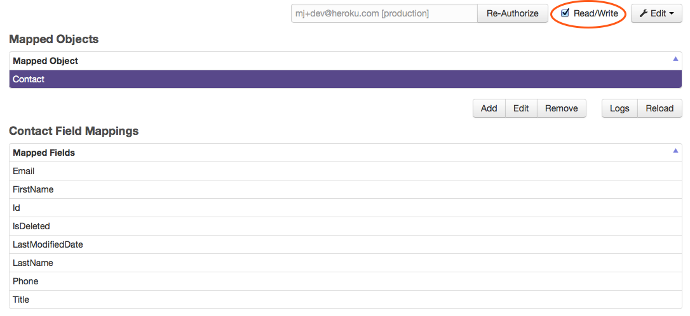

# Rails:Salesforce Contact syncing with Heroku Connect

Sync Contacts between Salesforce and a Rails app on Heroku using Heroku Connect.

## Heroku Connect Setup

### Create a new Heroku app

```
$ heroku create your_heroku_app_name
```

### Clone the new app change to that directory

```
$ heroku git:clone -a your_heroku_app_name
$ cd your_heroku_app_name
```

### Add a database and Heroku Connect to the app

```
$ heroku addons:add heroku-postgresql:standard-yanari
$ heroku addons:add herokuconnect
```

### Start the Heroku Connect configuration

```
$ heroku addons:open herokuconnect
```

### Complete the Heroku Connect configuration wizard

1. Select the database you want to use for Heroku Connect as `DATABASE_URL`.
1. Enter the database schema name as `salesforce`.
1. Select `Production` or `Sandbox` to sync data from your production/sandbox
Salesforce instance.
1. Authenticate using your Salesforce user credentials.

### Enable Contact syncing

1. Click the 'Add' button to map objects.
1. Select 'Contact'.
1. Select the `Email`, `FirstName`, `LastName`, `Phone` and `Title` fields.

### Enable Read/Write syncing

Select `Read/Write` above the mapped objects list.



## Rails Setup

### Create a new Rails app

Run this command in your your_heroku_app_name directory. The new app will be
configured to use Postgres.

```
$ rails new . -d postgresql
```

### Commit the app to git and deploy it to Heroku

```
$ git add .
$ git commit -m "New Rails app"
$ git push heroku master
```

### Secure the app

Commit the following to `app/controllers/application_controller.rb`.

```
force_ssl if: :ssl_configured?

auth_name = ENV['AUTH_NAME'] || 'name'
auth_password = ENV['AUTH_PASSWORD'] || SecureRandom.hex
http_basic_authenticate_with name: auth_name, password: auth_password

def ssl_configured?
  !Rails.env.development?
end
```

Set a username and password on Heroku.

```
$ heroku config:set AUTH_NAME=your_name AUTH_PASSWORD=your_super_secure_password
```

### Scaffold the Contact

Use Rails' scaffolding to create a `Contact` model. Delete the migration file
and commit the generated files as shown below.

```
$ rails g scaffold Contact email firstname lastname phone title
$ rm db/migrate/XXXXXXXXXXXXXX_create_contacts.rb
$ git add config
$ git add app
$ git commit -m "Create Contact Object"
```
